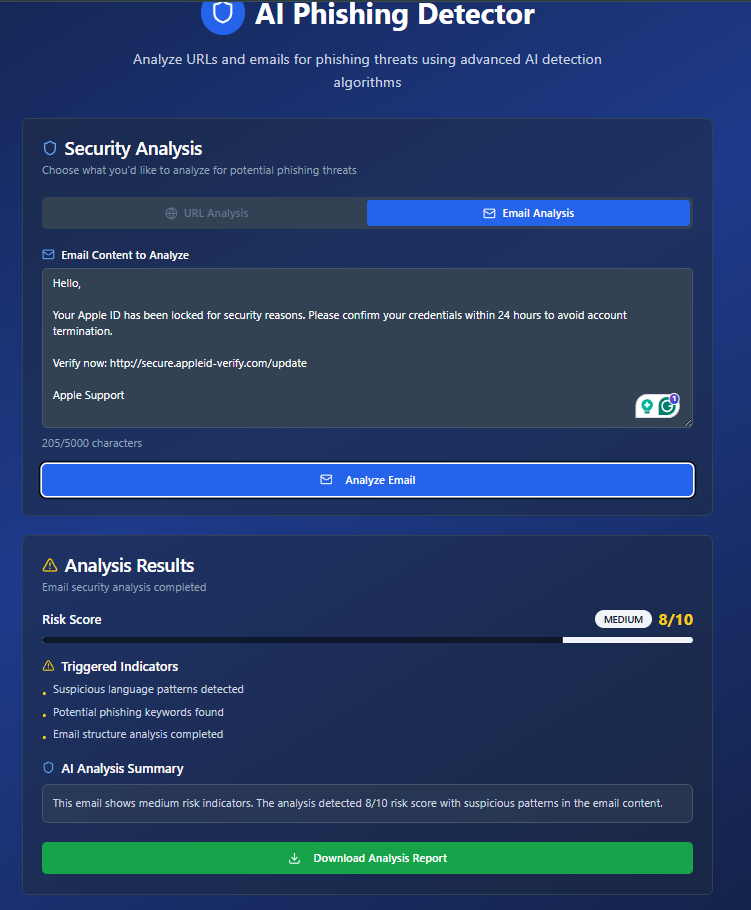

# AI Phishing Detector - Project Documentation

## Overview

AI Phishing Detector is a full-stack application designed to identify and assess the risk of phishing URLs and emails using heuristic techniques and AI-powered explanations. It provides detailed PDF reports based on the analysis and allows users to track past assessments. The frontend is built with Lovable (Vite + ShadCN + React), while the backend is a Flask API with Python logic for phishing detection.

Live site: [https://phishingdetecai.cloud](https://phisingdetecai.cloud/)

- **Frontend GitHub Repository**: [sentinel-phish-guard](https://github.com/EdouardosStav/ai-phishing-detector) *(Built with the help of Lovable)*
- **Backend GitHub Repository**: [phishing-detector](https://github.com/EdouardosStav/ai-phishing-detector)


---

## Screenshots

### Homepage


### Security Analysis Dashboard


### URL Analysis


### Email Analysis


### Reports History


## Research & Heuristics

Before implementing the detection logic, we conducted light research by exploring public resources, online tools, and existing phishing detection applications. Our goal was to identify practical heuristics commonly used to detect suspicious content in both URLs and emails.

Based on this research, we selected the following heuristics to inform our detection logic:

- **Keyword Matching**: Detection of terms frequently used in phishing, such as `"verify"`, `"login"`, `"update"`, `"account"`, and `"security alert"`.

- **TLD Riskiness**: Identification of suspicious top-level domains (TLDs), including `.tk`, `.ml`, `.ga`, and `.xyz`, which are often abused in phishing attacks due to low registration costs.

- **Subdomain Tricks**: Recognition of deceptive domain structures designed to impersonate trusted brands (e.g., `paypal.login.security-check.tk`).

- **Email Clues**: Analysis of email content for urgency, threatening language, fake support requests, and embedded suspicious links.

Additionally, we experimented with **GPT-based explanations** to enhance the interpretability of the results by summarizing technical heuristics into natural language insights for end users.

---

## Key Features

- Real-time phishing analysis of URLs and email content.
- Heuristic-based threat detection.
- Risk scoring system (0–10) with severity levels (Low, Medium, High).
- AI-generated explanations for enhanced interpretability.
- Exportable PDF reports.
- History of scanned items with user authentication.
- Full-stack architecture with frontend/backend separation.

---

## API Endpoints (Backend)

### `POST /analyze-url`

**Request**:

```json
{
  "url": "http://example.com"
}
```

**Response**:
```json
{
  "url": "http://example.com",
  "score": 7,
  "risk_level": "High",
  "indicators": ["login", "verify", "suspicious TLD"]
}
```
### `POST /analyze-email`

**Request**:

```json
{
  "email": "Verify your account at http://phish.com"
}
```

**Response**:
```json
{
  "email": "Verify your account at http://phish.com",
  "score": 5,
  "risk_level": "Medium",
  "indicators": ["Contains link", "Urgent language"]
}
```

### `POST /generate-report`

**Request**:  

```json
{
 "email": "Urgent: reset your password at http://malicious.com"
}
```

**Response**: Returns downloadable PDF containing the analysis of the URL.


### `POST /generate-email-report`

**Request**:
```json
{
  "email": "Urgent: reset your password at http://malicious.com"
}
```

**Response**: Returns downloadable PDF of email risk analysis.

---

## Future Implementations

1. **Screenshot-Based URL Analysis**  
   Integrate browser automation tools (e.g., [Puppeteer](https://pptr.dev/) or [Playwright](https://playwright.dev/)) to capture screenshots of suspicious URLs and analyze their visual structure.  
   This can help detect phishing attempts that mimic the UI of trusted websites but differ in subtle ways.

2. **Image-Based Machine Learning Detection**  
   Train a lightweight ML model (e.g., using **TensorFlow Lite** or **PyTorch**) to analyze screenshots of phishing pages.  
   The model would learn visual cues such as fake login forms, suspicious branding, or misleading prompts, expanding detection beyond textual heuristics.

3. **Scalable Microservices Deployment**  
   Refactor the backend into independent microservices (e.g., **analysis**, **PDF generation**, **auth**) and deploy them using serverless infrastructure like **AWS Lambda** or **Google Cloud Functions**.  
   This would improve scalability, allow horizontal scaling under load, and enable isolated updates to specific features without downtime.

---

## License

This project is licensed under the MIT License. See the [LICENSE](./LICENSE) file for details.

---